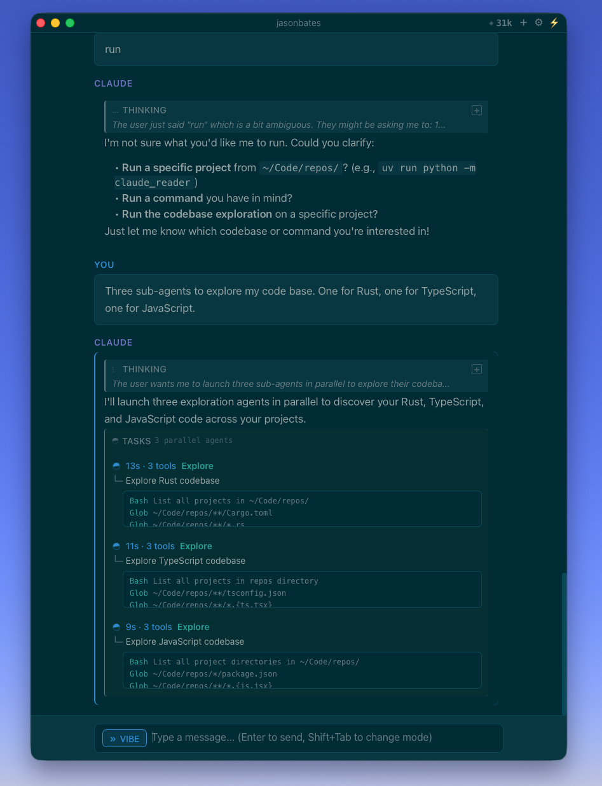
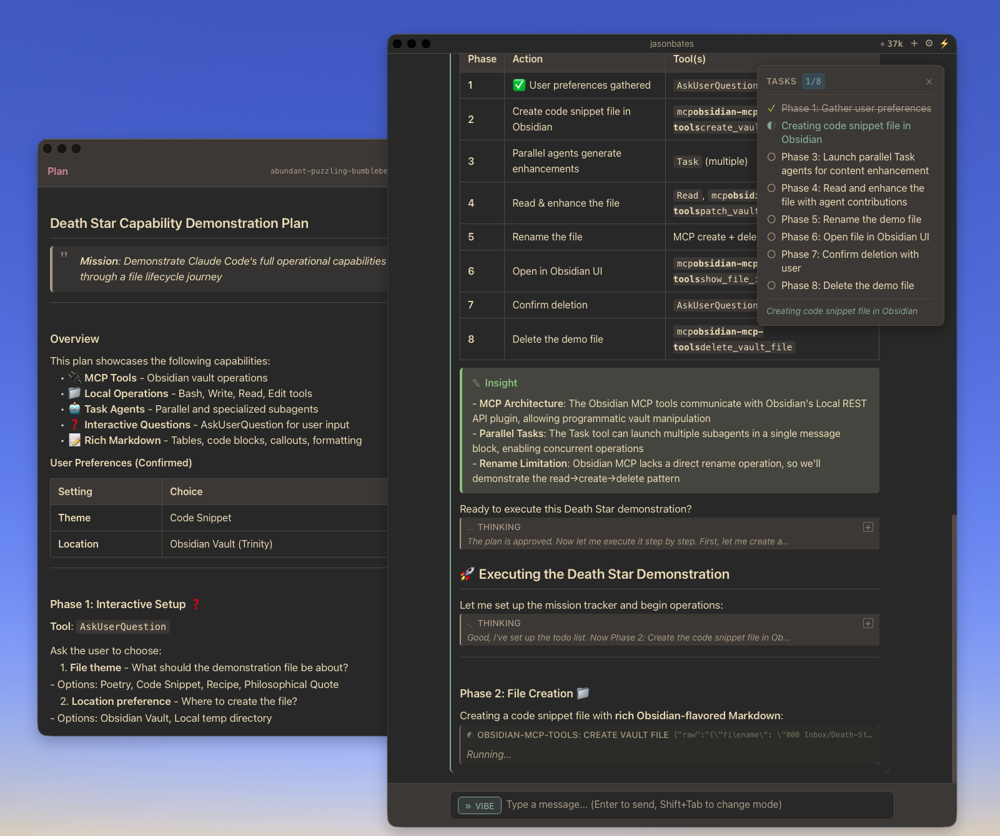
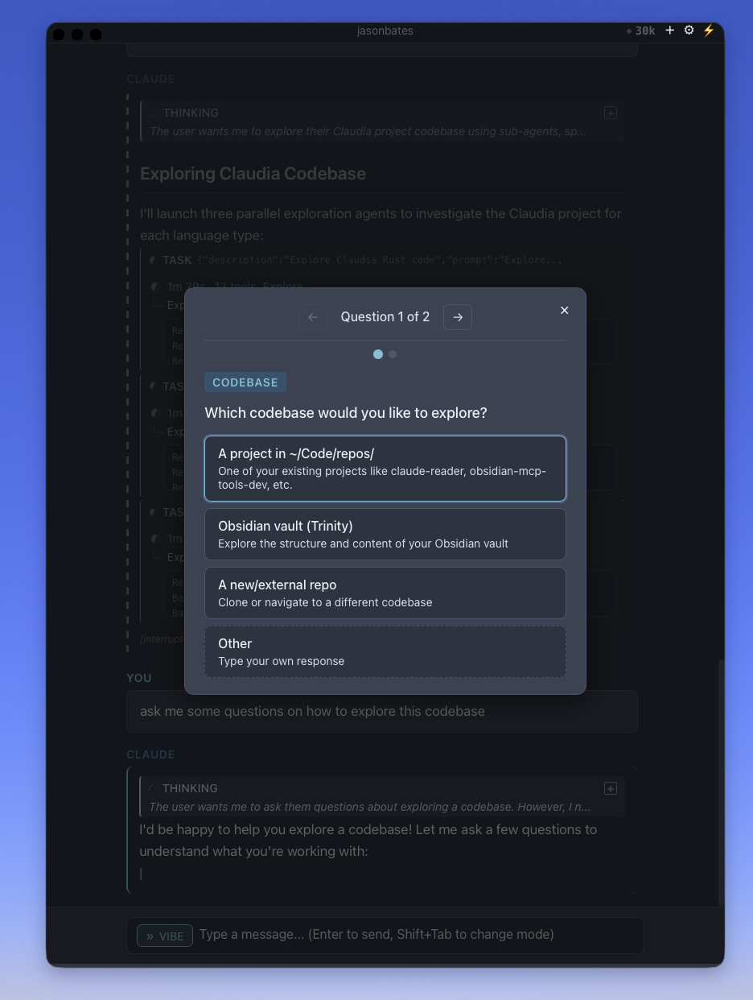

# Claudia

[](https://github.com/JasonBates/claudia/actions/workflows/test.yml)
[](LICENSE)

Claudia is an expandable GUI wrapper around [Claude Code](https://github.com/anthropics/claude-code), built for the Mac OS. It is designed for knowledge work, leveraging everything great about Claude Code: projects, config, skills, hooks, MCPs, session management, while providing a cleaner, more visual frontend experience. 


> *Why rebuild the agent runtime when you can wrap it?*

_Note: this is only a few days of development work, there are still bugs to work out, please open issues, and contribute fixes._

## Screenshots

<p align="center">
  
</p>
<p align="center"><em>Parallel subagents running with real-time status tracking</em></p>

<p align="center">
  
</p>
<p align="center"><em>Plan mode with task panel and detailed plan view</em></p>

<p align="center">
  
</p>
<p align="center"><em>Interactive questions with multiple choice options</em></p>

## Why Claudia?

Claude Code CLI is powerful but terminal-focused. Claudia gives you:

- **Proportional fonts and styling** — Who wants to stare at monospaced text all day
- **Visual tool tracking** — See what Claude is doing with collapsible, syntax-highlighted tool blocks
- **Real-time streaming** — Text and results appear as they're generated
- **Desktop integration** — Native macOS app, multi-window support, project-aware launching
- **All of Claude Code's power** — MCPs, skills, hooks, CLAUDE.md, session persistence, prompt caching

## Why Claudia instead of Cowork?

Cowork is Anthropic's managed desktop experience—great for users who want zero-config simplicity. Claudia is for developers who already use Claude Code and want more control:

- **Fully customizable** — UI, workflows, features, and memory are yours to modify
- **Per-project configuration** — different context, tools, and MCPs for each project directory
- **Your setup just works** — existing CLAUDE.md files, hooks, and MCP configs carry over
- **Direct file system access** — no sandboxed VM sitting between you and your files
- **Custom visualizations** — build data renderers directly into your MCPs

Cowork wraps a sandboxed environment. Claudia wraps Claude Code itself—so you keep everything you've already built.

## Features

- **Native macOS app** — Built with Tauri + SolidJS for fast, lightweight performance
- **Rich markdown rendering** — Full GitHub-flavored markdown with syntax-highlighted code blocks
- **Inline image display** — Images from Read tool results display inline, click to view full-size
- **Visual tool tracking** — Collapsible, syntax-highlighted tool blocks with JSON formatting
- **Real-time streaming** — Text and results appear as they're generated
- **CLI launcher** — Run `claudia` from any directory to use project-specific configs
- **Multi-instance support** — Multiple windows, each in different project directories
- **Type-ahead input** — Keep typing while waiting for responses
- **Smart permissions** — Auto-approve, plan mode, or per-tool dialogs
- **Extended thinking** — Expandable thinking blocks when enabled
- **Subagent visualization** — Track nested Task agents and their progress
- **Session resume** — Continue previous conversations with full context

## Installation

### Prerequisites

- Node.js 18+
- Rust toolchain
- Claude Code CLI (`claude` command available)

### Build from Source

```bash
git clone https://github.com/JasonBates/claudia.git
cd claudia
npm install
npm run tauri build
cp -R src-tauri/target/release/bundle/macos/Claudia.app /Applications/
```

### CLI Launcher

Install the `claudia` CLI launcher to open the app from any directory:

```bash
./install.sh
```

Or manually:

```bash
cp claudia ~/.local/bin/
chmod +x ~/.local/bin/claudia
```

Then from any project directory:

```bash
cd ~/Code/repos/my-project
claudia
```

This opens Claudia with that directory as the working directory, picking up project-specific `.claude/` configs.

## Usage

### Keyboard Shortcuts

| Shortcut | Action |
|----------|--------|
| **Escape** | Interrupt current response |
| **⌘ ,** | Open settings |
| **⌘ ⇧ [** | Toggle session sidebar |
| **⌥ T** | Toggle thinking display |
| **⌥ L** | Focus message input |
| **⌥ Q** | Quit application |

### Commands

| Command | Description |
|---------|-------------|
| `/clear` | Clear conversation history (restarts Claude process) |
| `/resume` | Open sidebar to resume a previous session |
| `/settings` | Open appearance settings |
| `/thinking` | Toggle extended thinking display |
| `/sidebar` | Toggle session sidebar |
| `/exit` `/quit` `/q` `/x` | Close the application |
| `! <command>` | Execute bash command directly (e.g., `! ls -la`, `! git status`) |

### Resuming Sessions

1. **Via sidebar**: Press `⌘ ⇧ [` or type `/resume` to open the session sidebar
2. **Via CLI**: Launch with `claudia --resume <session-id>`
3. **Browse history**: The sidebar shows recent sessions with timestamps and previews

## Architecture

Claudia wraps the Claude Code CLI to leverage its built-in features (MCPs, skills, hooks, session management, prompt caching) while providing a custom native UI.

```
┌─────────────────────────────────────────────────────────────────┐
│                      Claudia.app (Tauri)                        │
│              Custom UI + Desktop Integration                    │
├─────────────────────────────────────────────────────────────────┤
│  Frontend (SolidJS)          │  Backend (Rust)                  │
│  └─ Reactive UI components   │  └─ Process management, IPC      │
├─────────────────────────────────────────────────────────────────┤
│                     sdk-bridge-v2.mjs (Node.js)                 │
│                     └─ Thin event translation layer             │
├─────────────────────────────────────────────────────────────────┤
│                     Claude Code CLI                             │
│         └─ Full agent runtime: MCPs, skills, hooks,             │
│            sessions, compaction, prompt caching                 │
└─────────────────────────────────────────────────────────────────┘
```

For detailed architecture, data flow, event types, and implementation details, see [docs/architecture.md](docs/architecture.md).

## Development

```bash
# Development mode
npm run tauri dev

# Run all tests (608 tests: 113 Rust + 495 TypeScript)
npm run test:all

# TypeScript tests only
npm run test:run

# Rust tests only
npm run test:rust
```

## Documentation

| Document | Description |
|----------|-------------|
| **[docs/architecture.md](docs/architecture.md)** | Data flow, event types, state management, testing, design decisions |
| **[docs/streaming.md](docs/streaming.md)** | Streaming command runner pattern |
| **[docs/troubleshooting.md](docs/troubleshooting.md)** | Common issues, debugging techniques, lessons learned |
| **[CONTRIBUTING.md](CONTRIBUTING.md)** | How to contribute to Claudia |
| **[CHANGELOG.md](CHANGELOG.md)** | Version history and release notes |

## License

MIT
